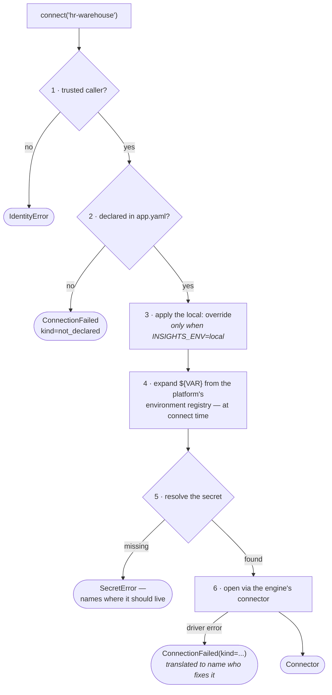

# insights-sdk

The library every app on [Insights Hub](https://github.com/KRISHNABR/insights-platform) imports,
and the `insights` CLI its team runs. One install, one dependency.

```bash
uv add "insights-sdk>=0.1,<1"
```

```python
from insights_sdk import web_app, run_job, connect, output, get_logger, require_role
```

That import line is the whole surface. Everything below documents it.

---

## Contents

- [What each module does](#what-each-module-does)
- [API reference](#api-reference) — every public name
- [The CLI](#the-cli) — every command
- [How a connection actually works](#how-a-connection-actually-works)
- [Tests](#tests) — what each file proves
- [Versioning](#versioning)

---

## What each module does

Read them in this order; each depends only on the ones above it.

| File | Responsibility |
|---|---|
| [`errors.py`](src/insights_sdk/errors.py) | The failure vocabulary. Every exception is a **refusal**, not a crash, and names the ADR behind it |
| [`config.py`](src/insights_sdk/config.py) | Loads and validates `app.yaml`. Unknown keys are refused, not ignored |
| [`identity.py`](src/insights_sdk/identity.py) | Who is calling, and whether we believe them. The trusted-edge model |
| [`secrets.py`](src/insights_sdk/secrets.py) | Resolving a credential without ever printing one |
| [`telemetry.py`](src/insights_sdk/telemetry.py) | Structured logs, and the redaction boundary that **raises** |
| [`connectors.py`](src/insights_sdk/connectors.py) | `connect()`, the engines, and the error translation that names who fixes a failure |
| [`entrypoints.py`](src/insights_sdk/entrypoints.py) | `web_app()` and `run_job()` — the two shapes an app can take |
| [`outputs.py`](src/insights_sdk/outputs.py) | What a scheduled job produces |
| [`deprecation.py`](src/insights_sdk/deprecation.py) | Deprecation telemetry — how upgrades stay possible with twelve dependants |
| [`cli/`](src/insights_sdk/cli/) | The `insights` command, and the generator that scaffolds new apps |

**If you read one file, read [`identity.py`](src/insights_sdk/identity.py).** It is short, and
every other control in the SDK rests on it: if `Caller.trusted` is false, nothing else is
allowed to happen.

> **There used to be a `broker.py` and an `adapters.py`.** The platform brokered every read —
> a catalog of datasets, an entitlement check, masking, an audit stream. That layer is gone;
> see [ADR-002](https://github.com/KRISHNABR/insights-platform/blob/main/docs/adr/0002-tenant-isolation-and-data-access.md).
> Teams connect to systems they already have access to, and the platform never sees a row.

---

## API reference

### Connecting to data — `connectors.py`

```python
connect(name: str) -> Connector
```

`name` is a connection you declared in `app.yaml`. **It is a name, never a target** — there is
no parameter for a host, a DSN or a credential, so what an app can reach is declared in git
rather than buried in a function three directories down.

```python
rows = connect("hr-warehouse").query(
    "SELECT dept, headcount FROM hr_headcount WHERE month = :m", m="2026-09"
)
```

Bind values with `:named` parameters; never format them in. For a `rest` connection, `query()`
takes a **path** rather than SQL:

```python
people = connect("directory").query("/people", dept="Engineering")
```

| Raises | When |
|---|---|
| `IdentityError` | there is no trusted caller — you are running outside the platform edge |
| `SecretError` | the credential did not resolve, naming the variable or path that should have held it |
| `ConnectionFailed` | anything else, including an undeclared name. Carries `.kind`, which names **who fixes it** |

`ConnectionFailed.kind` is one of `not_declared`, `config_missing`, `driver_missing`, `auth`,
`not_found`, `syntax`, `timeout`, `tls`, `network` — the last six translated from whatever the
driver said. `auth`, `not_found` and `syntax` are usually yours; `tls` and `network` are usually
the platform's. That translation is the point: a driver's own message rarely says whose problem
it is, so on a platform with three hundred apps it sends the ticket to the wrong team.

### Identity — `identity.py`

```python
current_user() -> Caller           # never raises; may be untrusted
require_trusted() -> Caller        # raises IdentityError if the edge did not vouch
require_role(tier: str) -> Caller  # "owner" | "contributor" | "reader"
```

`Caller.groups` is a **property that returns `()` unless `trusted`**. That is the whole trust
model in one line: an app running without the platform edge in front of it fails every
authorization check *structurally*, and no code anywhere has to remember to test a flag first.

The three tiers **nest** — an owner satisfies `require_role("reader")` without being listed as
one.

### Telemetry — `telemetry.py`

```python
log = get_logger()
log.info(event: str, **fields)    # also .warn() and .error()
```

Every record is automatically stamped with app, team, environment, request id, caller and SDK
version. You configure nothing.

**Log fields must be scalars.** Passing a dict, a list, a DataFrame or a very long string raises
`RedactionError` *at the point of writing*, not later at the sink — because scrubbing at the sink
fails open, and anything the scrubber does not recognise has already left the process.

```python
log.info("done", rows=len(rows))   # the shape
log.info("done", rows=rows)        # RedactionError
```

One stream, `events`. There is no separate audit stream: the platform is not in the data path,
so it has nothing to record about *what* was read.

### The two app shapes — `entrypoints.py`

```python
app = web_app()          # a FastAPI app with identity, logging and /healthz wired
```

Adds identity middleware, structured access logs, and a `/healthz` that opens every connection
you declared and confirms its credential arrived — so a deploy that starts fine and fails on
first use is caught at rollout rather than by a user. It does **not** run a query: a health
check hitting the warehouse every 30 seconds across three hundred apps is a load generator.

```python
@job
def main(): ...           # or: raise SystemExit(run_job(main))
```

Adds a service identity (`sp-<app>`), a run id, the timeout and retry contract, SIGTERM drain,
and the exit-code contract: `0` succeeded · `1` the job broke · `2` the platform refused it.

### Job outputs — `outputs.py`

```python
output(name: str, rows: Sequence[dict], fmt: str = "csv") -> str
```

Writes an artefact with the platform's default retention. Nothing to declare in the manifest.

### Deprecation — `deprecation.py`

```python
@deprecated(since="0.3", removed_in="1.0", instead="connect().query", symbol="query")
```

Emits one record per symbol per process — not per call — naming the app still using it. That
telemetry is what makes a removal a decision rather than a guess.

---

## The CLI

Run from inside an app repo, so it uses *your* pinned SDK: `uv run insights <command>`.

| Command | What it does |
|---|---|
| `new-app` | Generate a new app repo. The only command you run without a project |
| `doctor` | Validate the manifest — **the same code CI runs** |
| `connections` | What you declared, with `${VAR} -> resolved`, and whether the secrets resolve |
| `connections --probe` | Actually open each one. A real round trip, not a config check |
| `serve` | Run a web app locally, registering it with the edge and deregistering on exit |
| `run` | Run a job once, now |
| `logs` | Read telemetry. `--startup` for process logs when an app will not boot |
| `status` | What is registered right now |
| `build --show` / `--write` | The Dockerfile this manifest implies |
| `upgrade-scaffold` | Re-render the platform-owned files after an SDK upgrade |
| `up` | *(platform repo)* Start the edge, the console and the local stubs |
| `compliance-report` | *(platform repo)* Connections, failures by kind, redaction status |

---

## How a connection actually works

Six steps, in [`connectors.py`](src/insights_sdk/connectors.py). Steps 1 and 2 are enforceable
only because there is exactly one way to open a connection.



The credential is bound inside step 6 and never returned. `Secret.reveal()` is the only path to
a value, and `str`, `repr`, f-strings and `format` all give `<Secret name REDACTED>` — so a
traceback or a stray log line cannot leak one.

---

## Tests

```bash
uv run --no-project --with pytest --with pyyaml --with fastapi --with httpx \
  --with-editable . python -m pytest -q
```

91 tests. None of these are unit tests for their own sake — each turns a claim in an ADR into
evidence.

| File | What it proves |
|---|---|
| `test_identity_fails_closed.py` | A client cannot assert its own identity; an app outside the edge reads nothing; a job acts as itself; the tiers nest |
| `test_connectors_and_secrets.py` | A connection must be declared; `local:` merges and applies only locally; driver errors translate to a kind; a secret never stringifies; loopback ignores a broken proxy |
| `test_no_escape_hatch.py` | `connect()` takes a name and nothing that could be a target — fails if anyone adds one |
| `test_telemetry_boundary.py` | Logs cannot carry rows or a payload disguised as a string; every stream the CLI offers has a writer |
| `test_manifest_contract.py` | The access tiers; `kind` means something; credentials, classifications and service identities are refused |
| `test_generator_roundtrip.py` | A generated app loads, is valid, and its image installs the tenant's own dependencies |
| `test_tenant_dockerfile.py` | The generated image pins its base and never ends as root |
| `test_deprecation_telemetry.py` | The upgrade story is driven by data, once per symbol |
| `test_scheduler.py` | Cron matching, and that `concurrency: forbid` survives a restart |
| `test_cli_imports.py` | Every command is registered and has a handler; no module references a name that does not exist |

---

## Versioning

Semantic. Tenants declare a **floor** (`>=0.1,<1`), never a pin — the manifest loader rejects
`==`, because a pinned app is an app we eventually have to break. The platform supports the
current major and the two before it.

> `uv.lock` pins the resolved commit, not the tag. Moving `insights-sdk@v1` changes nothing for
> a tenant until they re-lock — which is the point, but it does mean a moved tag alone is not a
> rollout.

See [ADR-001](https://github.com/KRISHNABR/insights-platform/blob/main/docs/adr/0001-platform-shape-and-reuse-strategy.md)
for the mechanisms behind that, and [CHANGELOG.md](CHANGELOG.md) for what a release looks like.

## Why the CLI ships inside the SDK

`insights new-app` generates a repository whose CI callers and project file must be compatible
with the library version they target. Versioned apart, you get scaffold/library skew with no way
to detect it. Versioned together, that is structurally impossible — and `insights
upgrade-scaffold` can re-render those files later precisely because the SDK knows which ones it
owns.
