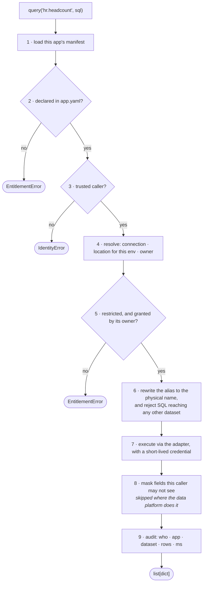

# insights-sdk

The library every app on [Insights Hub](https://github.com/KRISHNABR/insights-platform) imports,
and the `insights` CLI its team runs. One install, one dependency.

```bash
uv add "insights-sdk>=0.1,<1"
```

```python
from insights_sdk import web_app, run_job, query, fetch, get_logger, require_role
```

That import line is the whole surface. Everything below documents it.

---

## Contents

- [What each module does](#what-each-module-does)
- [API reference](#api-reference) — every public function
- [The CLI](#the-cli) — every command
- [How a read actually works](#how-a-read-actually-works)
- [Tests](#tests) — what each one proves
- [Versioning](#versioning)

---

## What each module does

Read them in this order; each depends only on the ones above it.

| File | Responsibility |
|---|---|
| [`errors.py`](src/insights_sdk/errors.py) | The failure vocabulary. Every exception is a **refusal**, not a crash, and names the ADR behind it |
| [`config.py`](src/insights_sdk/config.py) | Loads and validates `app.yaml` (the tenant's contract) and the platform registry (datasets, grants) |
| [`identity.py`](src/insights_sdk/identity.py) | Who is calling, and whether we believe them. The trusted-edge model |
| [`telemetry.py`](src/insights_sdk/telemetry.py) | Structured logs, the audit stream, and the redaction boundary that **raises** |
| [`adapters.py`](src/insights_sdk/adapters.py) | One adapter per connection type, resolved per environment |
| [`broker.py`](src/insights_sdk/broker.py) | **The centre of the design.** The single path from an app to any data |
| [`entrypoints.py`](src/insights_sdk/entrypoints.py) | `web_app()` and `run_job()` — the two shapes an app can take |
| [`outputs.py`](src/insights_sdk/outputs.py) | What a scheduled job produces, declared rather than wired |
| [`deprecation.py`](src/insights_sdk/deprecation.py) | Deprecation telemetry — how upgrades stay possible with 12 dependants |
| [`cli/`](src/insights_sdk/cli/) | The `insights` command, and the generator that scaffolds new apps |

**If you read one file, read [`broker.py`](src/insights_sdk/broker.py).** Everything else exists
to serve it.

---

## API reference

### Reading data — `broker.py`

```python
query(dataset: str, sql: str, **params) -> list[dict]
```
Read from a SQL-backed dataset. Write SQL against the **dataset name**, not a table — the
platform substitutes the physical location for the environment you are in, so the same query
works in dev, uat and prod. Bind values with `:named` parameters; never format them in.

```python
rows = query("hr.headcount",
             "SELECT dept, headcount FROM hr.headcount WHERE month = :m", m="2026-09")
```

| Raises | When |
|---|---|
| `EntitlementError` | the dataset is not in your `app.yaml`, or it is restricted and not granted |
| `IdentityError` | there is no trusted caller — you are running outside the platform |
| `UnknownDatasetError` | the dataset is not in the registry at all (a platform mistake, not yours) |

```python
fetch(dataset: str, *, params: dict | None = None) -> list[dict]
```
Read from a REST-backed dataset. The resource path comes from the registry, not from you.
Always returns a list of dicts, so masking and auditing are identical for both kinds.

**There is nothing else.** No `connect()`, no cursor, no DSN, no engine choice — and a test
asserts it stays that way.

### Identity — `identity.py`

```python
current_user() -> Caller          # never raises; returns an untrusted Caller if nobody is signed in
require_trusted() -> Caller       # raises IdentityError if the request did not come through the edge
require_role(role: str) -> Caller # raises AuthzError if the caller lacks the role
```

```python
class Caller:
    subject: str          # "dana@corp.example", or "svc:comp-report" for a scheduled run
    groups: tuple[str]    # EMPTY unless trusted — see below
    request_id: str
    trusted: bool
    is_service: bool      # True for a scheduled run, which has no human
```

**`groups` is a property, not a field.** It returns `()` whenever `trusted` is False, so an app
running without the platform edge in front of it fails every authorization check *structurally* —
no code anywhere has to remember to test a flag first.

### Telemetry — `telemetry.py`

```python
log = get_logger()
log.info(event: str, **fields)    # also .warn() and .error()
```

Every record is automatically stamped with app, team, environment, request id, caller and SDK
version. You configure nothing.

**Log fields must be scalars.** Passing a dict, a list, a DataFrame or a very long string raises
`RedactionError` *at the point of writing*, not later at the sink — because scrubbing at the sink
fails open, and anything the scrubber does not recognise has already left the process.

```python
log.info("done", rows=len(rows))   # ✅ the shape
log.info("done", rows=rows)        # ❌ RedactionError
```

For apps reading restricted data, the logger additionally refuses any record mentioning a
**field name** from that dataset — the list comes from the platform, so a tenant cannot shorten it.

### The two app shapes — `entrypoints.py`

```python
app = web_app()          # a FastAPI app with identity, logging, metrics and /healthz wired
```
Adds: identity middleware, structured access logs, a `/healthz` that resolves every dataset you
declared and checks its credential arrived, and — for `web.type: spa` — serving your own
frontend from `static/` on the same origin.

```python
run_job(fn) -> int       # returns an exit code: 0 ok · 1 the job broke · 2 the platform refused
```
Runs a scheduled job under the platform contract: a service identity, a stable `run_id`,
start/finish telemetry, and a `SIGTERM` handler that drains rather than dying mid-write.

### Job outputs — `outputs.py`

```python
output(name: str, rows: Sequence[dict]) -> str
```
Write a declared output. You name the artefact in `app.yaml`; the platform decides where it
physically lives, who can read it and when it expires. Writing an undeclared name raises
`ManifestError`.

### Deprecation — `deprecation.py`

```python
@deprecated(since="0.2", removed_in="1.0", instead="query()")
def run_sql(...): ...
```
Emits one telemetry event per symbol per process, naming the app, version and symbol — so the
platform team can see *who is still on the old path* and cut a major when that list empties,
rather than on a date. This is what makes the upgrade story in ADR-001 work.

---

## The CLI

Every command either **generates something correct** or **shows you evidence**. There is no
command that explains a rule — a rule that needs explaining is enforced in the wrong place.

| Command | What it does |
|---|---|
| `insights new-app NAME --kind web\|job --team T --owner GROUP` | Generate a new app repo: manifest, `pyproject.toml`, source stub, four CI workflows |
| `insights doctor` | Everything CI will check, checked locally first — **the same code path**, so they cannot disagree |
| `insights datasets` | What this app can read, and what it could request (name and owner only — not a data catalog) |
| `insights build --show` | Print the exact Dockerfile that would be built for this app |
| `insights build` | Render it to `.insights/` and run `docker build` |
| `insights run` | Run this app locally the way the platform runs it — same identity, same environment |
| `insights up [--port N]` | Start the whole local platform: warehouse, REST stub, every app, the edge |
| `insights status` | Every registered app: team, kind, SDK version, last seen |
| `insights access request --dataset D` | Draft an access request for the **dataset owner** — we cannot approve it |
| `insights access approve --dataset D --app A --approver P` | Record a grant (run by the dataset owner) |
| `insights compliance-report --dataset D` | The artefact you hand a compliance reviewer |
| `insights upgrade-scaffold [--check]` | Re-render the platform-owned files in this repo |

---

## How a read actually works

Nine steps, in [`broker.py`](src/insights_sdk/broker.py). Steps 2, 5, 6 and 9 are enforceable
only because there is exactly one code path to data.



---

## Tests

```bash
uv run --with pytest --with pyyaml --with fastapi python -m pytest -q     # 55 tests
```

None of these are unit tests for their own sake. Each turns a claim in an ADR into evidence.

| File | What it proves |
|---|---|
| `test_identity_fails_closed.py` | A client cannot assert its own identity; an app outside the edge reads nothing; a job acts as itself |
| `test_entitlement.py` | Knowing a name is not access; declaring a restricted dataset is not enough; errors do not form a discovery oracle |
| `test_portability_and_masking.py` | The same SQL reads a different table per environment; masking follows the caller; a job's unmask comes from the **grant**, not its own manifest |
| `test_telemetry_boundary.py` | Logs cannot carry rows, and cannot mention a restricted field name |
| `test_no_escape_hatch.py` | There is no exported way round the broker — fails if anyone adds one |
| `test_manifest_contract.py` | The two access planes; `kind` means something; only supported web shapes and base images |
| `test_generator_roundtrip.py` | A generated app loads and is valid; the image installs the tenant's own dependencies |
| `test_deprecation_telemetry.py` | The upgrade story is driven by data, once per symbol |

---

## Versioning

Semantic. Tenants declare a **floor** (`>=0.1,<1`), never a pin — the manifest loader rejects
`==`, because a pinned app is an app we eventually have to break. The platform supports the
current major and the two before it.

See [ADR-001](https://github.com/KRISHNABR/insights-platform/blob/main/docs/adr/0001-platform-shape-and-reuse-strategy.md)
for the seven mechanisms behind that, and [CHANGELOG.md](CHANGELOG.md) for what a release looks
like.

## Why the CLI ships inside the SDK

`insights new-app` generates a repository whose CI callers and project file must be compatible
with the library version they target. Versioned apart, you get scaffold/library skew with no way
to detect it. Versioned together, that is structurally impossible — and `insights
upgrade-scaffold` can re-render those files later precisely because the SDK knows which ones it
owns.
